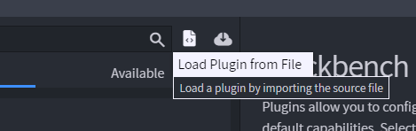
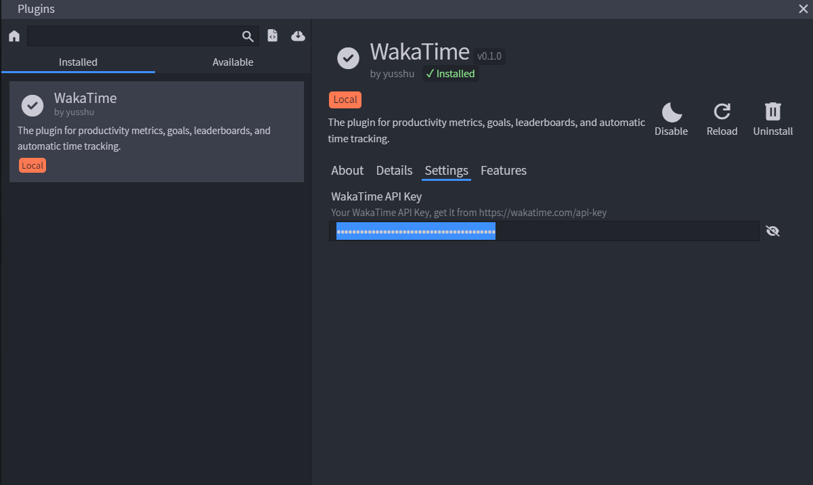

# WakaTime for Blockbench

Blockbench-WakaTime is an open source plugin for metrics, insights, and time tracking automatically generated from your modelling activity.

## Installation

1. Download the [latest release](https://github.com/HibiscusMC/blockbench-wakatime/releases/latest)

2. In Blockbench, go to File > Plugins..., click "Load Plugin from File" and select the `wakatime.js` file. 

3. Once installed, go to [https://wakatime.com/api-key](https://wakatime.com/api-key) and copy you API Key.

4. Paste your API Key in the plugin settings. 

5. Use Blockbench and your activity will be displayed on your [WakaTime dashboard](https://wakatime.com/).